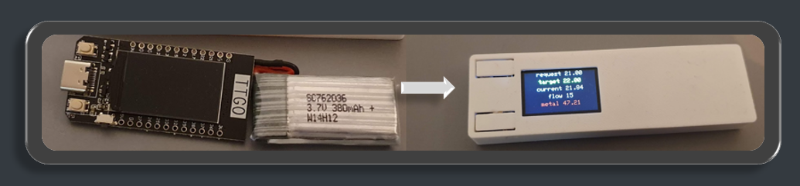
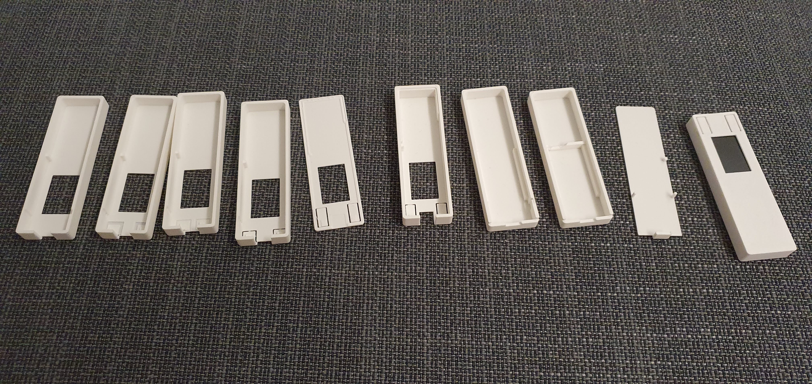

# ESP32 Case for up/down remote control

[ESP32 Rmote](/models/esp32_remote.glb)

:button[]{ label="STL models zip" link="/models/esp32_remote.zip" icon="download"}

# Application

:button[]{ label="More details on the ESP32 Arduino code" link="/microcontrollers/esp32/ttgo-t-display#thermostat-control" }

3D printing creation requires sometimes quite a number of iterations

