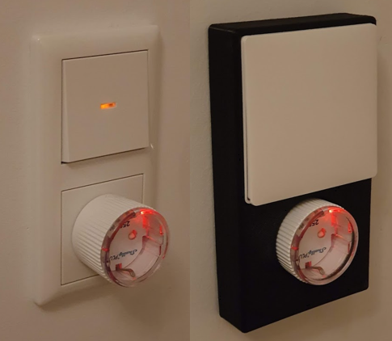

# Cover Dumb Switch and smart Socket

[Wall Switch Double](/models/wall_switch_double.glb)

:button[]{label="STL Model" link="/models/wall_switch_double.stl" icon="download"}

# Application

:button[]{link="/frameworks/raspi-iot#home-status" label="More details on the raspberry pi service"}
