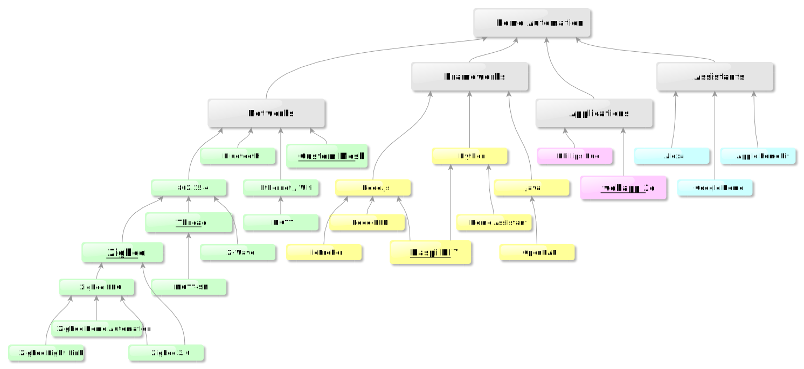
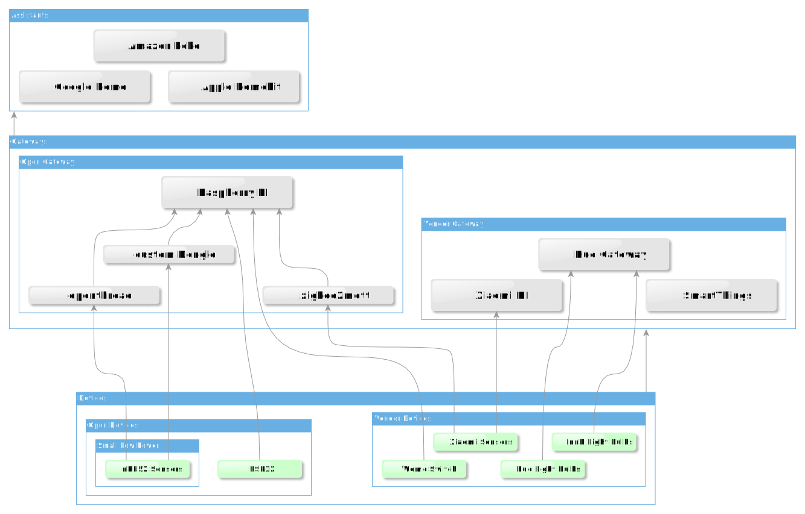

# Home Automation Mind Map

# Home Automation Devices

In the diagram above, we can see a partitioning into Vendor specific Gateways and Open Gateways for which the Raspberry pi is an ideal open Hardware standard.

The same partitioning is done for the devices,  where the ESP32 and the Arduino are a major player in the DIY electronics. More and more users are crossing the step of bravery of building their own garage opener, which might be less secure as a protocol, but as it is limited to local network can occur much less risk than vendors devices that could be Hacked from the other side of the world.

Then comes [Thread](/docs/networks/thread/), which is the current hope of unifying all vendors and makers around one protocol and a common gateway. It is indeed promising as the current gateway reference design is based on a raspberry pi boarder router

# Background
## Networks
Ethernet and wifi being used by most generic consumer devices is very convenient and is used wherever it is possible. Even smaller devices with relatively low power such as [ESP32](/docs/microcontrollers/esp32/) can use wifi, which solves all communication questions and can even provide a webserver hosted on the microcontroller. Usage of websocket allow browsers and webapps such as [Home 3D](/docs/applications/home3d/) to be independent from proxy servers which increases the flexibility of the client servers architecture and allows clients to run on any device (Smartphone / PC : mac, win,linux).  MQTT lowers the application overhead in comparison to REST API and solves all communication scenarios with client polling and server based events notification.

The 2.4 GHz range clusters in two groups, user centered environment and Autonomous server based environment. The user, expected to be armed with a smartphone, has placed the Bluetooth as main protocol for device to user direct interactions. Although Bluetooth is catching up by adding support for Mesh, this mixes of concerns in order to win market over mesh based devices has kept support for Bluetooth mesh marginal. Zigbee, based on the 802.15.4 standard, has well succeeded into providing products suited for home applications. Currently support is added for sub GHz, but most devices operate in the 2.4 GHz. Limitations from both frequency and transmission power have been solved by the mesh protocol, where light bulbs, as first target of Zigbee, play the role of routers. If to think about a mesh at home, what a better location for a router than in the center of the room, right on the ceiling for obstacle avoidance and in a spot with access to power supply to allow permanent radio listening and packets routing, and this is where the light bulbs are usually placed.

Zigbee has been struggling with profiles compatibility which challenges users’s understanding and trust of compatibility. The standard’s focus moved from ZLL (Zigbee Light Link) to ZHA (Zigbee Home Automation), then to Zigbee 3.0 keeping retro compatibility at device level (not routing level). Is Thread going to supersede Zigbee ? The question is rather when ? Thread, using ipv6, provides a generic resolution of addresses  between local networks and internet which is standard defined and vendor agnostic. In order to catch up and not to lose the market, the Zigbee alliance are pushing the “dot dot” to grow to application level for both protocols, and hope to allow products smoothly transit and support both. At the same time, Thread came with a concept allowing MQTT-SN (Sensor’s Network) to run at the node level, which still does not replace the zigbee applicative layer. So last but not least, and as a response to this situation, the Zigbee aliance is deviating the focus from dot dot to the favor of an attempt to unify everyone with [Matter Protocol](/docs/frameworks/matter/) which is so to say the ipv6 capable zigbee (as it uses the Zigbee Clusetr Library at the application level) and backed up by the big tech companies.

How can a user invest in a home equipment without getting deprecated before the installation is complete ? How can a user use his favorite User Interface with his favorite Light bulbs and Sensors ? And this without requiring Hacker’s skills ? These are still open questions.

## Frameworks, Applications, Assistants
Two main frameworks appeared in order to answer the compatibility issues and interoperability problems. OpenHAB and [Home Assistant](/docs/frameworks/home_assistant/). Both try to be compatible with most smart devices available in the market, and provide a common interface that allow control and creation of rules.  While the success is undeniable for the compatibility and control of many devices, the user interface still obey the rules of physics, being either ugly and functional, nice looking but annoying to use, or both nice and practical but require a genius skills for configuration. It is legitimate to try to invent a new language for writing rules, so that the non developers have to learn a special programming language anyway, one they cannot use anywhere other than in one app, and the developers are extremely annoyed with the limitations, still have to memorize more key words and deal with issues of immature programming concepts only observed in the early stages of standard languages development. The custom environments, if they have a well isolated configuration or one custom prepared configuration, they can compete with open frameworks or even with consumer grade applications.

Philips Hue is mentioned because the light bulbs are the first successful product in home automation. By successful, it is meant that the product is truly smart, without degradation of the basic functionality, like a PC that needs 5 minutes to boot that makes you wish you sent the mail by post. Philips Hue has the limitation of not having a concept for event based API notification, they do not allow PUTs to custom local URLs.

Assistants are listed here as part of the Automation scene, Alexa, Google and Apple Home. These assistants are here to help on particular circumstances where voice control is suited. Two regressions in the quality of life can happen from their usage. First, if the voice becomes the only way to actuate a device, that turns things as simple and quick as pressing a button into shouting at night and begging and repeating just to switch a TV on. Second, all complex orders that would require complete paragraph of description to get you what you want, while with a slider, the space geometry is intuitive enough to save you that pain. Same for selecting a particular channel, or opening the window just enough to let a bit of wind and not too much not to let a cat through.

The smartest environment is definitely the one that knows what you want so that you don’t need to ask. Knows that you’re reading a book so adjusts the light on reading level in the spot where you're sitting, so the less screens and the less talk required, the smarter is the environment.

Will the Matter Protocol allow Big Techs, Startups and Makers to cooperate and provide the service everyone is best at and plug it easily on the rest of the Home Automation ?
