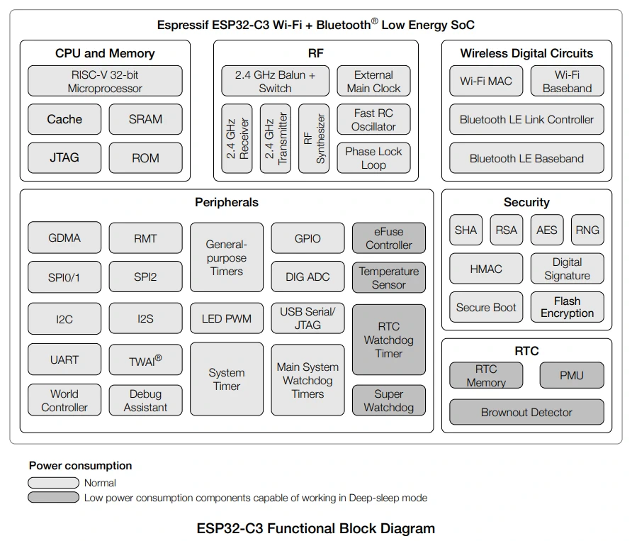
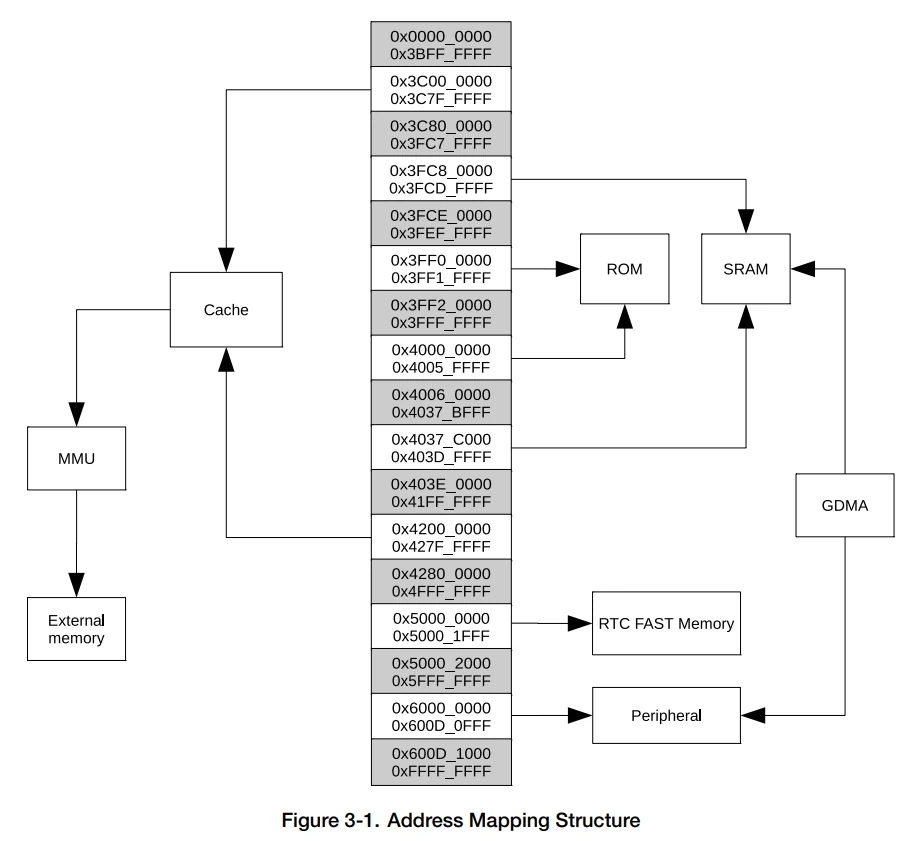

## ESP32
### Datasheet
* [Datasheet](https://www.espressif.com/sites/default/files/documentation/esp32_datasheet_en.pdf)

#### Blockdiagram

#### Memory Map

#### Power Modes

### WROOM Datasheet
* [ESP32-WROOM-32 Datasheet](https://www.espressif.com/sites/default/files/documentation/esp32-wroom-32_datasheet_en.pdf)

#### Pin Layout

## ESP32-S2

### Datasheet
* [ESP32-S2 Datasheet](https://www.espressif.com/sites/default/files/documentation/esp32-s2_datasheet_en.pdf)

#### Block Diagram

#### Memory

#### Power Modes

### S2 Technical Reference Manual
* [TRM](https://www.espressif.com/sites/default/files/documentation/esp32-s2_technical_reference_manual_en.pdf)

## ESP32-C3
* [ESP32-C3 datasheet](https://www.espressif.com/sites/default/files/documentation/esp32-c3_datasheet_en.pdf)

### Block Diagram

### Address Mapping structure

### C3 Technical Reference Manual
* [TRM](https://www.espressif.com/sites/default/files/documentation/esp32-c3_technical_reference_manual_en.pdf)
