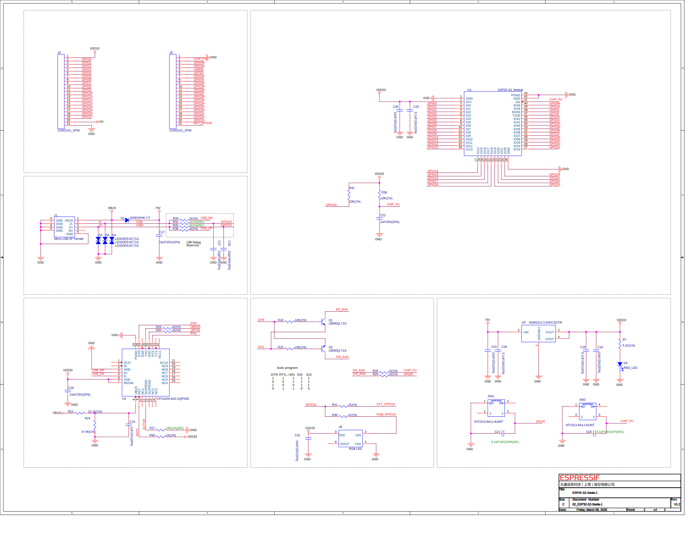

# ESP32 S2 Saola 1
:button[]{link="https://docs.espressif.com/projects/esp-idf/en/latest/esp32s2/hw-reference/esp32s2/user-guide-saola-1-v1.2.html" label="Product page"}

:image[]{src="/images/esp32/esp32-s2-saola-1.webp" width="300" center}

:button[]{label="Pin Layout" link="https://docs.espressif.com/projects/esp-idf/en/latest/esp32s2/hw-reference/esp32s2/user-guide-saola-1-v1.2.html#pin-layout"}

# Features
* [ESP32-S2-WROVER](https://www.espressif.com/sites/default/files/documentation/esp32-s2-wrover_esp32-s2-wrover-i_datasheet_en.pdf)
* RGB LED (GPIO18)

# Schematics

* pdf : https://dl.espressif.com/dl/schematics/ESP32-S2-SAOLA-1_V1.1_schematics.pdf

