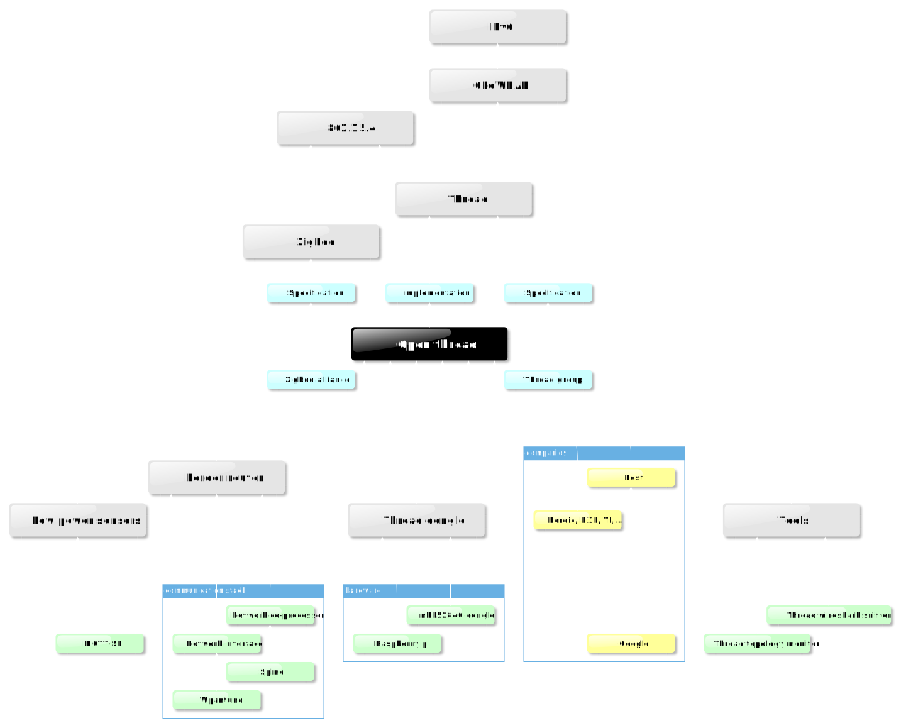
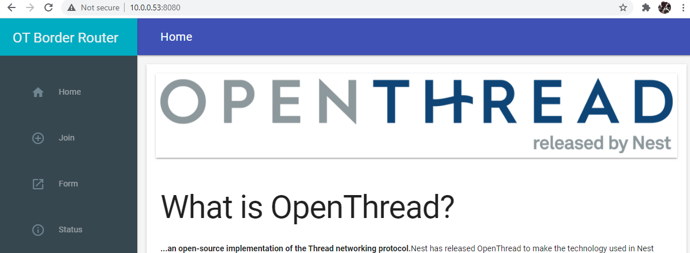
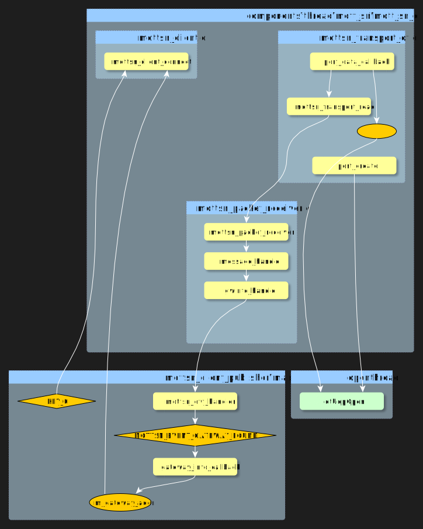
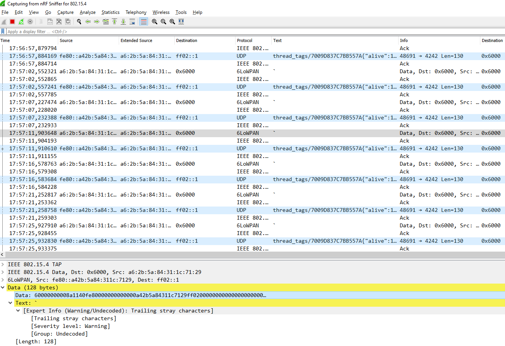

:button[]{link="/microcontrollers/nrf52/thread_sensortag/" label="Thread SensorTag"}
:button[]{link="/frameworks/zephyr/" label="Zephyr RTOS"}
:button[]{link="/frameworks/matter/" label="Project Matter"}

# Overview


* some elements have link to the corresponding websites

:button[]{link="https://openthread.io/" label="Open Thread"}
:button[]{link="https://openthread.io/guides/thread-primer/ipv6-addressing" label="IPV6 adressing"}
:button[]{link="https://openthread.io/guides/thread-primer/network-discovery" label="Network discovery"}
:button[]{link="https://openthread.io/guides/border-router/docker/test-connectivity" label="test connectivity"}
:button[]{link="https://openthread.io/reference" label="openthread API reference"}

## Cheat sheet
* IPv6 bit length : 128 bit = 8x 16 ibts => `00b1:00b2:00b3:00b4:00b5:00b6:00b7:00b8`
* Link-Local prefix : `fe80::/16`
* Mesh-Local prefix : `fd00::/8`
* Multicast Link-Local : `ff02::1`
* Multicast Mesh-Local : `ff03::1`
* RLOC16 : Routing locator in 16 bits `0x0401`
* RLOC16 Router mask : `0x0400`
* IID : Interface Identifier (includes RLOC16)
* RLOC = Mesh-Local Prefix + IID


## Specification

:button[]{link="https://www.threadgroup.org/ThreadSpec" label="request the specification"}

## Tools

:button[]{link="https://www.nordicsemi.com/Software-and-tools/Development-Tools/nRF-Connect-for-desktop/Download#infotabs" label="nRF Connect for desktop"}
:button[]{link="https://www.nordicsemi.com/Software-and-tools/Development-Tools/nRF-Command-Line-Tools/Download#infotabs" label="nRF Command Line Tools"}
:button[]{link="https://developer.arm.com/tools-and-software/open-source-software/developer-tools/gnu-toolchain/gnu-rm/downloads/7-2018-q2-update" label="GNU Arm Embedded Toolchain v7-2018-q2"}
:button[]{link="https://infocenter.nordicsemi.com/topic/struct_sdk/struct/sdk_thread_zigbee_latest.html" label="nRF SDK for Thread and Zigbee v4.1.0"}
:button[]{link="https://www.nordicsemi.com/Software-and-tools/Software/nRF5-SDK-for-Thread-and-Zigbee/Download#infotabs" label="download the SDK"}
:button[]{link="http://developer.nordicsemi.com/nRF_Connect_SDK/doc/latest/nrf/gs_assistant.html" label="nRF Connect SDK installing"}

* install `nRF Connect for deskop`
* From within nRF connect, install `Toolchain Manager`
* From the Toolchain manager, install the last `nRF Connect SDK`


## Thread Nodes
A Thread network setup contains the following Nodes

* radio or network coprocessor : dongle connected to the raspberry pi
* border router host : services running on a raspberry pi
* cli tester : command line dongle through serial monitor for testing
* mqtt-sn : end device with mqtt-sn such as sensors

* [Topology Monitor](https://www.nordicsemi.com/Software-and-tools/Development-Tools/nRF-Thread-topology-monitor) : GUI interface. Note the hex file to flash on the nRF52840 USB dongle are provided as part of the download pack in `nRF_TTM-win32-x64_0.13.0.zip\nRF_TTM-win32-x64\hex`. A different CLI or NCP fimware would not work.

* [Wireshark sniffer](https://www.nordicsemi.com/Software-and-tools/Development-Tools/nRF-Sniffer-for-Bluetooth-LE) : dongle that captures all frames and shows them on wireshark

# Border Router
To create a border router, a usb dongle needs to be flashed (Radio Co-Processor) and attached to a raspberry pi where the following services are installed.
## raspberry pi

:button[]{link="https://openthread.io/codelabs/openthread-border-router-nat64#0" label="Border Router with NAT64"}
:button[]{link="https://openthread.io/guides/border-router/build#set-up-the-border-router" label="Setup - OpenThread"}

install git if not already available

```bash
git clone https://github.com/openthread/ot-br-posix
cd ot-br-posix
export NAT64=1 NAT64_SERVICE=openthread
./script/bootstrap
INFRA_IF_NAME=eth0 ./script/setup
sudo nano /etc/default/otbr-agent
sudo reboot now
sudo systemctl status
sudo ot-ctl state
```


* *issue*: in case a `dnsmasq` service already running, might have to be disabled first
* *issue*: in case of not being able to create a network (not advertising on wireshark) a new raspi install might be required as network adapters conflicts might prevent the otber-agent from running properly

the `/etc/default/otbr-agent` service config file should be configured with the right adapter
```bash
# Default settings for otbr-agent. This file is sourced by systemd
# Options to pass to otbr-agent
OTBR_AGENT_OPTS="-I wpan0 -B eth0 spinel+hdlc+uart:///dev/ttyACM0"
```

The status of the running services look as follows.
These services should now be available :
* `avahi-daemon`
* `otbr-agent` : access the usb device and creates wpan0
* `otbr-web`   : creates the OTBorderRouter web server
* `wpa_supplicant`
:::details{summary="sudo systemctl status"}
```bash
pi@metal:~ $ sudo systemctl status
● metal
    State: running
     Jobs: 0 queued
   Failed: 0 units
    Since: Thu 1970-01-01 01:00:01 CET; 51 years 1 months ago
   CGroup: /
           ├─user.slice
           │ └─user-1000.slice
           │   ├─session-3.scope
           │   │ ├─1663 sshd: pi [priv]
           │   │ ├─1669 sshd: pi@pts/0
           │   │ ├─1670 -bash
           │   │ ├─1687 sudo systemctl status
           │   │ ├─1688 systemctl status
           │   │ └─1689 pager
           │   ├─user@1000.service
           │   │ └─init.scope
           │   │   ├─1637 /lib/systemd/systemd --user
           │   │   └─1638 (sd-pam)
           │   └─session-1.scope
           │     ├─ 864 /bin/login -f
           │     └─1648 -bash
           ├─init.scope
           │ └─1 /sbin/init splash
           └─system.slice
             ├─ncp_state_notifier.service
             │ ├─427 /bin/sh /usr/sbin/ncp_state_notifier
             │ ├─432 dbus-monitor --system type='signal', interface=org.freedesktop.DBus.Properties, path
             │ └─433 /bin/sh /usr/sbin/ncp_state_notifier
             ├─alsa-state.service
             │ └─395 /usr/sbin/alsactl -E HOME=/run/alsa -s -n 19 -c rdaemon
             ├─containerd.service
             │ └─553 /usr/bin/containerd
             ├─systemd-timesyncd.service
             │ └─341 /lib/systemd/systemd-timesyncd
             ├─NetworkManager.service
             │ ├─420 /usr/sbin/NetworkManager --no-daemon
             │ └─633 /sbin/dhclient -d -q -sf /usr/lib/NetworkManager/nm-dhcp-helper -pf /run/dhclient-et
             ├─dbus.service
             │ └─409 /usr/bin/dbus-daemon --system --address=systemd: --nofork --nopidfile --systemd-acti
             ├─hciuart.service
             │ └─826 /usr/bin/hciattach /dev/serial1 bcm43xx 3000000 flow -
             ├─udisks2.service
             │ └─394 /usr/lib/udisks2/udisksd
             ├─docker.service
             │ └─853 /usr/bin/dockerd -H fd:// --containerd=/run/containerd/containerd.sock
             ├─ssh.service
             │ └─564 /usr/sbin/sshd -D
             ├─ser2net.service
             │ └─868 /usr/sbin/ser2net -c /etc/ser2net.conf -P /run/ser2net.pid
             ├─avahi-daemon.service
             │ ├─393 avahi-daemon: running [metal.local]
             │ └─398 avahi-daemon: chroot helper
             ├─otbr-web.service
             │ └─428 /usr/sbin/otbr-web
             ├─wpa_supplicant.service
             │ └─419 /sbin/wpa_supplicant -u -s -O /run/wpa_supplicant
             ├─triggerhappy.service
             │ └─442 /usr/sbin/thd --triggers /etc/triggerhappy/triggers.d/ --socket /run/thd.socket --us
             ├─systemd-logind.service
             │ └─439 /lib/systemd/systemd-logind
             ├─polkit.service
             │ └─511 /usr/lib/policykit-1/polkitd --no-debug
             ├─otbr-agent.service
             │ └─423 /usr/sbin/otbr-agent -I wpan0 spinel+hdlc+uart:///dev/ttyACM0
             ├─telegraf.service
             │ └─542 /usr/bin/telegraf -config /etc/telegraf/telegraf.conf -config-directory /etc/telegra
             ├─cron.service
             │ └─437 /usr/sbin/cron -f
             ├─systemd-udevd.service
             │ └─181 /lib/systemd/systemd-udevd
             ├─rsyslog.service
             │ └─403 /usr/sbin/rsyslogd -n -iNONE
             ├─bluetooth.service
             │ └─831 /usr/lib/bluetooth/bluetoothd
             ├─inetd.service
             │ └─857 /usr/sbin/inetd
             ├─bluealsa.service
             │ └─834 /usr/bin/bluealsa
             ├─systemd-journald.service
             │ └─121 /lib/systemd/systemd-journald
             ├─bind9.service
             │ └─560 /usr/sbin/named -u bind
             ├─rng-tools.service
             │ └─415 /usr/sbin/rngd -r /dev/hwrng
             └─dhcpcd.service
               └─473 /sbin/dhcpcd -q -b
```
:::

After forming a network, the interface would look as follows 
:::details{summary="ifconfig wpan0"}
```bash
wpan0: flags=4305<UP,POINTOPOINT,RUNNING,NOARP,MULTICAST>  mtu 1280
        inet6 fd85:454:6529:a0c5:9ebb:d761:b6d:df4e  prefixlen 64  scopeid 0x0<global>
        inet6 fd11:22::7005:5eac:6482:e2ec  prefixlen 64  scopeid 0x0<global>
        inet6 fe80::94bf:4de7:183c:f37d  prefixlen 64  scopeid 0x20<link>
        inet6 fd85:454:6529:a0c5:0:ff:fe00:fc00  prefixlen 64  scopeid 0x0<global>
        inet6 fd85:454:6529:a0c5:0:ff:fe00:d400  prefixlen 64  scopeid 0x0<global>
        unspec 00-00-00-00-00-00-00-00-00-00-00-00-00-00-00-00  txqueuelen 500  (UNSPEC)
        RX packets 0  bytes 0 (0.0 B)
        RX errors 0  dropped 0  overruns 0  frame 0
        TX packets 9  bytes 1524 (1.4 KiB)
        TX errors 0  dropped 0 overruns 0  carrier 0  collisions 0
```
:::

## Radio Co-Processor (RCP)
:::Caution
Using a deprecated version of RCP not matching the raspberry pi installed otbr-agent version will prevent it from running
:::

* Ready binaries : are provided below. Versions with `=USB` can be flashed with nRF-Connect `Programmer` tool and the defaul `nRF52840-usb dongle` bootloader.
It is also possible to directly flash a non USB version with an SWD debugger or recover the original bootloader (with an SWD debugger) from the hex available from [this post](https://devzone.nordicsemi.com/f/nordic-q-a/40924/how-can-i-restore-the-original-bootloader-of-a-pca10059)

:button[]{link="/data/ot-rcp-com-1.2-usb_27.08.2021.hex.zip" label="ot-rcp 27.08.2021 OT_BOOTLOADER=USB"}
:button[]{link="/data/ot-rcp-com-1.2_27.08.2021.hex.zip" label="ot-rcp 27.08.2021"}
:button[]{link="/data/ot-rcp_thread-reference-20191113_nRF52840_dongle_no_bootloader.zip" label="ot-rcp thread-reference-20191113"}
:button[]{link="/data/ot-rcp_de3ddb7169_20.03.2021_USB_BL-USB.zip" label="ot-rcp 20.03.2021 BOOTLOADER=USB"}
:button[]{link="/data/ot-rcp_de3ddb7169_20.03.2021_USB_BL-No.zip" label="ot-rcp 20.03.2021 No Bootloader"}


* Manual build : Link to the official documentation of build instructions
:button[]{link="https://github.com/openthread/ot-nrf528xx/blob/main/src/nrf52840/README.md" label="new nRF52840 Build instructions"}

Build instructions summary
```bash
cd ~/ot-nrf528xx
./script/bootstrap
sudo rm -rf build/
./script/build nrf52840 USB_trans -DOT_COMMISSIONER=ON -DOT_THREAD_VERSION=1.2 -DOT_BOOTLOADER=USB
./script/build nrf52840 USB_trans -DOT_COMMISSIONER=ON -DOT_THREAD_VERSION=1.2
cd build/bin/
arm-none-eabi-objcopy -O ihex ot-rcp ot-rcp-com-1.2.hex
nrfjprog -f nrf52 --eraseall
nrfjprog -f nrf52 --chiperase --program ot-rcp-com-1.2.hex --reset
```


## udp test
:::Caution
Note that for networking tests, a border router installation is recommended or network between docker and the host has to be configured.
:::


The [openthread-setup](#openthread---setup) should be performed to be able to install and use `socat`.
Listening from `ot-ctl` :
```shell
$sudo ot-ctl
>udp open
>udp bind :: 4242
```
:::Caution
A current issue is that the `wpan0` adapter is lost after closing the ot-ctl command line
:::

Listening using `socat`:
```shell
$socat UDP6-LISTEN:4242,fork STDOUT
```
on the nRF52 node Zephyr shell :
```shell
>ot udp open
>ot udp send ff02::1 4242 hi_there_now
```
## Form a network

* on the raspi command line

```bash
sudo ot-ctl dataset init new

sudo ot-ctl dataset channel 24
sudo ot-ctl dataset channel
sudo ot-ctl dataset panid 0x1234
sudo ot-ctl dataset panid
sudo ot-ctl dataset networkname ThreadMatter
sudo ot-ctl dataset networkname
sudo ot-ctl dataset extpanid 1111111122222222
sudo ot-ctl dataset networkkey 00112233445566778899aabbccddeeff
sudo ot-ctl dataset

sudo ot-ctl dataset commit active

sudo ot-ctl ifconfig up
sudo ot-ctl thread start
```

* check with
```bash
sudo ot-ctl state
sudo ot-ctl netdata show
sudo ot-ctl ipaddr
```

* on the web interface

connect on the raspberry pi url `http://10.0.0.41/`



* on the left menu click on `Join` then select the required paramters (e.g. Channel,...) then click on `FORM` 
## wireshark sniffing

* git clone https://github.com/NordicSemiconductor/nRF-Sniffer-for-802.15.4
* Folow the user guide especially section `Installing the nRF Sniffer capture plugin in Wireshark`
  * Flash the `nrf802154_sniffer_dongle.hex`
  * configure the used masterkeys in wireshark menu `Edit/Preferences` then `Protocols/IEEE 802.15.4` in Decryption Keys `Edit...`

When Forming a network, some Pakets can be sniffed including advertisment


# MQTT Sensors Node
* MQTT-SN is a protocol not requiring `Thread` necessarily, it is rather a protcol for a bridge that allows clients to interact with an MQTT Broquer with minimal payload and packets transfers, therefore, it is well adapted to ip over low power mesh networks such as `Thread`.

* Example firmware `mqttsn_sleepy_publisher` and `mqttsn_client_publisher` are a port of the nRFSDK example from PCA10056 which was the only supported board to the PCA10059, the nRF52840 USB dongle, therefore the search gateway, connect, publish sequence have been merged in on button and run cyclically on each new press.

:button[]{link="https://github.com/HomeSmartMesh/nrf52_thread_sensortag/tree/main/firmware/mqttsn_sleepy_publisher" icon="github" label="mqttsn_sleepy_publisher"}
:button[]{link="https://github.com/HomeSmartMesh/nrf52_thread_sensortag/tree/main/firmware/mqttsn_client_publisher" icon="github" label="mqttsn_client_publisher"}
:button[]{link="https://www.oasis-open.org/committees/download.php/66091/MQTT-SN_spec_v1.2.pdf" icon="new" label="MQTT-SN_spec_v1.2.pdf"}


useful commands
```bash
sudo systemctl status paho-mqttsn-gateway.service
sudo /usr/sbin/MQTT-SNGateway -f /etc/paho-mqtt-sn-gateway.conf
sudo nano /etc/paho-mqtt-sn-gateway.conf
```

:::details{summary="paho-mqtt-sn-gateway.conf"}
```conf
#**************************************************************************
# Copyright (c) 2016-2019, Tomoaki Yamaguchi
#
# All rights reserved. This program and the accompanying materials
# are made available under the terms of the Eclipse Public License v1.0
# and Eclipse Distribution License v1.0 which accompany this distribution.
#
# The Eclipse Public License is available at
#    http://www.eclipse.org/legal/epl-v10.html
# and the Eclipse Distribution License is available at
#   http://www.eclipse.org/org/documents/edl-v10.php.
#***************************************************************************
#
# config file of MQTT-SN Gateway
#

# IPv4 Address of iot.eclipse.org
BrokerName=10.0.0.42
BrokerPortNo=1883
BrokerSecurePortNo=8883

#
# When AggregatingGateway=YES or ClientAuthentication=YES,
# All clients must be specified by the ClientList File
#

ClientAuthentication=NO
AggregatingGateway=NO
QoS-1=NO
Forwarder=NO

#ClientsList=/path/to/your_clients.conf

PredefinedTopic=NO
#PredefinedTopicList=/path/to/your_predefinedTopic.conf

#RootCAfile=/etc/ssl/certs/ca-certificates.crt
#RootCApath=/etc/ssl/certs/
#CertsFile=/path/to/certKey.pem
#PrivateKey=/path/to/privateKey.pem

GatewayID=1
GatewayName=PahoGateway-01
KeepAlive=900
#LoginID=your_ID
#Password=your_Password


# UDP
GatewayPortNo=10000
MulticastIP=225.1.1.1
MulticastPortNo=1883

# GatewayUDP6Broadcast address is set to all Thread devices address
# in order to enable Thread Sleepy Devices to receive multicast messages
# sent from the gateway.
# UDP6
GatewayUDP6Port = 47193
GatewayUDP6Broadcast = ff03::1
GatewayUDP6If = wpan0

# XBee
Baudrate=38400
SerialDevice=/dev/ttyUSB0
ApiMode=2

# LOG
ShearedMemory=NO;
```
:::

Test vector for sending a `SEARCHGW` message to the MQTT-SQ gateway service
```bash
#send (Length 3)(MsgType SEARCHGW=1)(Radius 1)
echo -n -e "030101" | xxd -r -p | nc -u fd11:1111:1122:0:98bf:60c7:9431:ee90 47193
```

## Firmware flow diagram
running the firmware example `mqtt_client_publisher` results in the following logs

:::details{summary="MQTT-SN gateway log"}
```shell
pi@raspberrypi:~ $ sudo /usr/sbin/MQTT-SNGateway -f /etc/paho-mqtt-sn-gateway.conf
ClientList can not open the Predefined Topic List.     /etc/predefinedTopic.conf

 ***************************************************************************
 * MQTT-SN Transparent Gateway
 * Part of Project Paho in Eclipse
 * (http://git.eclipse.org/c/paho/org.eclipse.paho.mqtt-sn.embedded-c.git/)
 *
 * Author : Tomoaki YAMAGUCHI
 * Version: 1.3.1
 ***************************************************************************

20210213 194529.539 PahoGateway-01 has been started.

 ConfigFile: /etc/paho-mqtt-sn-gateway.conf
 SensorN/W:   Gateway Port: 47193 Broadcast Address: ff03::1 Interface: wpan0
 Broker:     10.0.0.42 : 1883, 8883
 RootCApath: (null)
 RootCAfile: (null)
 CertKey:    (null)
 PrivateKey: (null)


20210213 194535.931   SEARCHGW          <---  Client                              03 01 01
20210213 194535.932   GWINFO            --->  Clients                             03 02 01

20210213 194541.989   CONNECT           <---  nRF52840_publisher                  18 04 04 01 00 3C 6E 52 46 35 32 38 34 30 5F 70 75 62 6C 69 73 68 65 72
20210213 194541.997   CONNECT           ===>  nRF52840_publisher                  10 1E 00 04 4D 51 54 54 04 02 00 3C 00 12 6E 52 46 35 32 38 34 30 5F 70 75 62 6C 69 73 68 65 72
20210213 194542.042   CONNACK           <===  nRF52840_publisher                  20 02 00 00
20210213 194542.042   CONNACK           --->  nRF52840_publisher                  03 05 00

20210213 194542.055   REGISTER    0001  <---  nRF52840_publisher                  1D 0A 00 00 00 01 6E 52 46 35 32 38 34 30 5F 72 65 73 6F 75 72 63 65 73 2F 6C 65 64 33
20210213 194542.056   REGACK      0001  --->  nRF52840_publisher                  07 0B 00 01 00 01 00

20210213 194550.331   PUBLISH     0002  <---  nRF52840_publisher                  08 0C 20 00 01 00 02 01
20210213 194550.331   PUBLISH     0002  ===>  nRF52840_publisher                  32 1C 00 17 6E 52 46 35 32 38 34 30 5F 72 65 73 6F 75 72 63 65 73 2F 6C 65 64 33 00 02 01
20210213 194550.338   PUBACK      0002  <===  nRF52840_publisher                  40 02 00 02
20210213 194550.338   PUBACK      0002  --->  nRF52840_publisher                  07 0D 00 01 00 02 00

20210213 194557.499   PUBLISH     0003  <---  nRF52840_publisher                  08 0C 20 00 01 00 03 00
20210213 194557.500   PUBLISH     0003  ===>  nRF52840_publisher                  32 1C 00 17 6E 52 46 35 32 38 34 30 5F 72 65 73 6F 75 72 63 65 73 2F 6C 65 64 33 00 03 00
20210213 194557.515   PUBACK      0003  <===  nRF52840_publisher                  40 02 00 03
20210213 194557.516   PUBACK      0003  --->  nRF52840_publisher                  07 0D 00 01 00 03 00

20210213 194602.541   PUBLISH     0004  <---  nRF52840_publisher                  08 0C 20 00 01 00 04 01
20210213 194602.542   PUBLISH     0004  ===>  nRF52840_publisher                  32 1C 00 17 6E 52 46 35 32 38 34 30 5F 72 65 73 6F 75 72 63 65 73 2F 6C 65 64 33 00 04 01
20210213 194602.547   PUBACK      0004  <===  nRF52840_publisher                  40 02 00 04
20210213 194602.547   PUBACK      0004  --->  nRF52840_publisher                  07 0D 00 01 00 04 00
```
:::

:::details{summary="Firmware J-Link RTT log"}
```shell
<info> app_timer: RTC: initialized.
<info> app: Thread version   : OPENTHREAD/20191113-00534-gc6a258e3; NRF52840; Apr  5 2020 21:53:43
<info> app: Network name     : OpenThreadDemo
<info> app: Thread interface has been enabled.
<info> app: 802.15.4 Channel : 13
<info> app: 802.15.4 PAN ID  : 0x1234
<info> app: Radio mode       : rx-on-when-idle
<warning> app_timer: RTC instance already initialized.
<info> app: State changed! Flags: 0x0117D33D Current role: 1
<info> app: State changed! <info> app: (0)
<info> app: MQTT-SN event: Client has found an active gateway.
<info> app: MQTT-SN event: Client has found an active gateway.
<info> app: MQTT-SN event: Gateway discovery procedure has finished.
<info> app: MQTT-SN event: Gateway discovery result: 0x0.
<info> app: (1)
<info> app: Wake up first time
<info> app: MQTT-SN event: Client connected.
<info> app: MQTT-SN event: Client registered topic.
<info> app: MQTT-SN event: Topic has been registered with ID: 1.
<info> app: (2)
<info> app: Wake up next times
<info> app: MQTT-SN event: Client has successfully published content.
<info> app: (2)
<info> app: Wake up next times
<info> app: MQTT-SN event: Client has successfully published content.
<info> app: (2)
<info> app: Wake up next times
<info> app: MQTT-SN event: Client has successfully published content.
```
:::


## Firmware search gateway



# Building on other frameworks
## Platformio
* although Zephyr is integrated in platformio, openthread is unfortunately not yet supported as of `framework-zephyr 2.20400.201210 (2.4.0)`
* docs.platformio [limitations](https://docs.platformio.org/en/latest/frameworks/zephyr.html#limitations)
## Arduino
* in discussion in this [openthread issue#1803](https://github.com/openthread/openthread/issues/1803), the issue is that Arduino lacks the netwroking layers required to provide a descent interface to the app.

# Build with Matter Node
As the `Matter Protocol` can run over `Thread`, it is possible to connect Matter applications.

:button[]{link="/frameworks/matter/" label="More about Project Matter"}

# Command Line Interface

:button[]{link="https://github.com/openthread/openthread/blob/main/src/cli/README.md#openthread-cli-reference" label="Openthread CLI Reference"}

## cli on border router
in this case the dongle is flashed with ot-rcp.hex not with ot-cli.hex
```shell
sudo ot-ctl state
sudo ot-ctl
>
```

## cli dongle

* building with openthread repo

:button[]{link="https://github.com/openthread/ot-nrf528xx/blob/main/src/nrf52840/README.md" label="new nRF52840 Build instructions"}
```bash
cd ~/ot-nrf528xx
./script/bootstrap
./bootstrap
sudo rm -rf build/
./script/build nrf52840 USB_trans -DOT_COMMISSIONER=ON -DOT_JOINER=ON -DOT_THREAD_VERSION=1.2
cd build/bin/
arm-none-eabi-objcopy -O ihex ot-cli-ftd ot-cli-ftd-com-join.hex
```

:button[]{link="/data/ot-cli-ftd_thread-reference-20191113_nRF52840_dongle_no_bootloader.zip" label="ot-cli-ftd thread-reference-20191113"}
:button[]{link="/data/ot-cli-ftd-com-join-11.06.2021.hex" label="ot-cli-ftd thread-reference-20191113"}

```bash
nrfjprog -f nrf52 --eraseall
nrfjprog -f nrf52 --program ot-cli-ftd.hex --sectorerase --verify
```

* building with nRFSDK

:button{link="https://developer.nordicsemi.com/nRF_Connect_SDK/doc/latest/nrf/samples/openthread/cli/README.html" label="new nRF52840 Build instructions"}


```bash
cd nrf\v2.3.0\nrf\samples\openthread\cli
>west build -p always -b nrf52840dongle_nrf52840 -- -DOVERLAY_CONFIG="overlay-usb.conf" -DDTC_OVERLAY_FILE="usb.overlay"
>nrfutil pkg generate --hw-version 52 --sd-req=0x00 --application build/zephyr/zephyr.hex --application-version 1 build/zephyr/zephyr.zip
nrfutil dfu usb-serial -pkg build/zephyr/zephyr.zip -p COM8
```

then on terminal laways preceed with `ot` for openthread commands
```bash
uart:~$ ot state
disabled
Done
```

* connecting a node with credentials

```bash
panid 0x1234
panid
channel 24
channel
networkname OpenThreadDemo
networkname
extpanid 1111111122222222
masterkey
ifconfig up
thread start
state
```


Note `masterkey` command is for the `Network Key`

at this stage the `state` command should log `child`

wireshark should log the join as follows


* it's possible to ping with the router ip

```bash
>ping fe80::c85c:d0c4:1103:31d5
Done
> 16 bytes from fe80:0:0:0:c85c:d0c4:1103:31d5: icmp_seq=2 hlim=64 time=12ms
```

a good exercice is to commission a device through CLI

:button[]{link="https://openthread.io/guides/border-router/external-commissioning" label="External commitioning"}


## cli reference
:button[]{link="https://github.com/openthread/openthread/blob/master/src/cli/README.md" label="thread cli reference"}

:::details[]{summary="ncp cli. Click to expand..."}
```shell
cu -l /dev/ttyACM0 -s 115200
panid 0xabcd
ifconfig up
thread start
state
ping fd00:0064:0123:4567::0808:0808
router list
```

adresses
```shell
panid
rloc16
eui64
extaddr
extpanid
ipaddr
ipmaddr
leaderdata
```
:::

# Commissioning
:::Caution
note that the security concept is based on the confidentiality of the masterkey, the one used here is a dummy key used for demo purpose only. Setting a predefined masterkey is optional, the stack will generate a random one that can be retrieved with the `masterkey` command if it's needed for analysis purpose.
:::

* make sure you use cli dongles with Commissioner and joiner compile options, see [cli dongle](#cli-dongle)
* [openthread commissioning](https://openthread.io/guides/build/commissioning)
* [commissioning commands](https://github.com/openthread/openthread/blob/main/src/cli/README_COMMISSIONER.md)
* [dataset commands](https://github.com/openthread/openthread/blob/main/src/cli/README_DATASET.md)
* make sure the used masterky is configured in the [wireshark sniffer](#wireshark-sniffing) to analyse the exchange

on the commissioner cli run
```bash
thread stop
ifconfig down

dataset init new
dataset
dataset channel 24
dataset channel
dataset masterkey 00112233445566778899aabbccddeeff
dataset commit active
ifconfig up
thread start
commissioner start
commissioner joiner add * ABCDE2
```
on the joiner cli run
```bash
factoryreset
ifconfig up
joiner start ABCDE2
```

:::details{summary="commissioner and joiner logs"}
* commissioner log
```bash
> commissioner start
Commissioner: petitioning
Done
> Commissioner: active

> commissioner joiner add * ABCDE2
Done
> ~ Discovery Request from 76380f6b58cf89f6: version=3,joiner=1
Commissioner: Joiner start a320c9053f0862ce
Commissioner: Joiner connect a320c9053f0862ce
Commissioner: Joiner finalize a320c9053f0862ce
Commissioner: Joiner end a320c9053f0862ce
```
* joiner log
```bash
> joiner start ABCDE2
Done
> Join success
```
* wireshark sniffing should display among others the following transactions
  * MLE : Discovery Request
  * MLE : Discovery Response
  * DTLSv1.2 : Client Hello
  * DTLSv1.2 : Hello Verify Request
  * DTLSv1.2 : Server Hello, Server Key Exchange, Server Hello Done
  * DTLSv1.2 : Client Key Exchange, Change Cipher Spec, Encrypted Handshake Message
  * ...
:::

# Thread UDP packets
* Thread UDP packets are encapsulated using 6LoWPAN which has a payload of 88 Bytes, that's why such a json UDP text message 
```text
thread_tags/7009D837C7BB557A{"alive":18673,"voltage":3.106,"light":184.948,"temperature":24.56,"humidity":46.49,"pressure":961.90}
```
is split in two packets where each has an ACK. From one side that's a lot x4 times of what the RF power consumption could be for a simple broadcast, but at the same time it avoids taking care of manually adapting the program behaviour to accomodate the protocol. Also keeping a json text format instead of binary avoids a middle layer converting binary to text readable by apps, that would cost a bottleneck dependency between each device and the gateway.



# FAQ - Discussion
* If you need support, want to ask a question or suggest a different answer, you can join the discussion on the github forum
:button[]{link="https://github.com/HomeSmartMesh/sdk-hsm-sensortag/discussions" label="Home Smart Mesh - OpenThread category"}


* see also
:button[]{link="https://groups.google.com/g/openthread-users" label="google groups openthread users"}
:button[]{link="https://www.threadgroup.org/support#faq" label="threadgroup FAQ"}


:::details{summary="What is the difference between RCP/NCP Thread Stack ?"}
RCP stands for Radio Co-Processor and only includes the MAC Layer not the full Thread Core stack. More details : https://openthread.io/platforms#network-co-processor-ncp
:::

:::details{summary="What is the difference between FTD/ETD Thread Devices ?"}
FTD = `Full Thread device` can be a Thread router or more, an ETD `End Thread Device` can be `M:minial` or `S:Sleepy` and in both cases does not route packets. More details https://openthread.io/guides/thread-primer/node-roles-and-types
:::

:::details{summary="What is the difference between using an RCP/NCP and running Thread as a stand alone device ?"}
The difference only lays on the partitioning of the application, in the RCP/NCP the application runs on the Host be it a raspberry pi or another uC, in the stand alone the whole thread stack and app run on the same device. We can think of the NCP as example like the CLI=`command line interface` Thread utility, but the protocol is not text mode rather binary. If the host is an uC itself, the question would be, why using two uC and if it is possible rather to merge them in just one, a corner case might need that like for example a double uC with WiFi and thread capabiltiy.
:::

:::details{summary="Does the Thread Topolog Monitor use the same CLI firmware as the openthread CLI ?"}
No, the Thread Topology monitor TTM comes with it own firmware that needs to be flashed
:::

:::details{summary="How does the Thread Topolog Monitor work ? What can it see ?"}
The Thread Topolog Monitor TTM is an active node on the network, it needs the credentials to be able to join it and only then it can retrieve info from the network it will also display itself in the network.
:::

:::details{summary="What is the difference between the Thread Topology Monitor and the 802.15.4 sniffer ?"}
The 802.15.4 sniffer does not join the network and is totally passive. It can listen to all the traffic of the channel it is in, including all pan ids. If it has the master key, it can then decript data from the corresponding network.
:::

:::details{summary="can I run openthread with Arduino ?"}
No, at least not at the moment and not within a native integration similar to the wifi and network in arduino, see the list of libraries and the connectivity section https://www.arduino.cc/reference/en/libraries/. Despite being known to be an IDE, under the hoods, Arduino is also a framework. The current preferred and supported framework for openthread is Zephyr-OS.
:::

:::details{summary="can I run openthread with platformio ?"}
This is under investigation and should be available soon. The current platformio integration of Zephyr-OS does not include openthread, but this is likely to change any time soon.
:::

:::details{summary="Which other families than nRF from Nordic support Thread ?"}
Many platforms are supported including but not limited to `Cascoda`, `NXP`, `Qorvo` which extends to uwb variant, `Samsung`, `Silicon Labs`, `STMicroelectronics`, `Synopsys`, `Telink Semiconductors`, `TI`  more details on openthread [platforms](https://openthread.io/platforms).
Note that `Espressif` although listed in the platforms, does not support `802.15.4` therefore can only run the openthread stack as a host that requires an external RCP from the previous list.
:::
