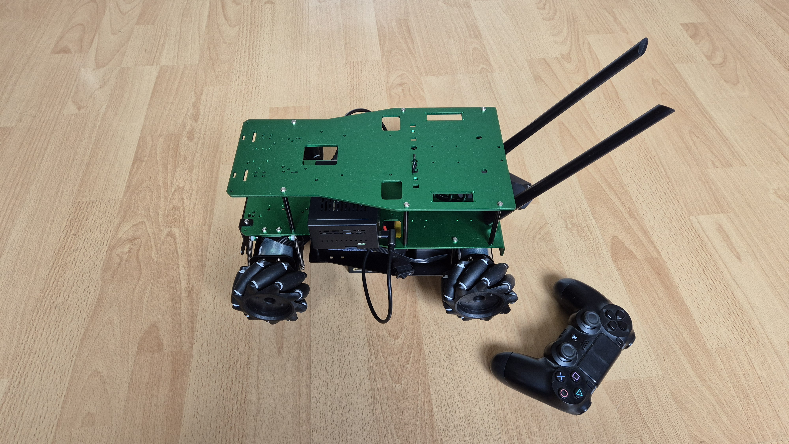

# Description
A car robot platform based on the Yahboom Rosmaster X3-Plus mecanum chassis, customized sensors and fresh new ROS2 Jazzy software for native ubuntu 24 development (no docker) on Raspberry pi 5



Photo from the latest development stage. The robot can be controlled with PS4 joystick over bluetooth and using python and Rosmaster_Lib.

# Versions

This robot will be built in stage with progressive functionalities

| version | Description | Peripherals | Batteries | USB |
| ---     |     ---  | --- | --- | --- |
|Manual | Test car movement with a Joystick| WiFi, M-Control, BT Joystick | 12_V | Raspi_Ports |
|Navi | ROS2 Navigation with Lidar | WiFi, M-Control, Lidar | 12_V + USB_Bank | x1 Hub |
|Navi+ | Navigation with Depth obstacles avoidance | WiFi, M-Control, Lidar, Depth | 12_V + USB_Bank | x1 Hub |
| VR | Stereo Camera for Virtual Reality telepresence and inspection | WiFi, M-Control, Lidar, Depth, Stereo_Cam | 12_V + USB_Bank | x1 Hub |
| Interaction | Interactive voice communication | WiFi, M-Control, Lidar, Depth, Stereo_Cam, Mic_Array, Speaker | 12_V + USB_Bank | x2 Hubs |

# USB Peripherals
In order to extend the robot runtime, in addition to the the 12_V motors board battery, a second USB power bank is used to power the Raspberry Pi 5 and its USB peripherals.


The Raspberry Pi 5 could draw 5V@5A profile, but the max a USB power bank can deliver @5V is 5V@4.5A which is not a big difference. We also notice that if we power the USB Hub, we can fully cover the maximum power the Raspberry Pi 5 could draw.

* Without drawing power from the Pi USB, it runs at 3 W when idle and could reach a max theoretical of 15 W
* Weger Power Bank 20000 mAh can deliver 22.5 W and has 5V@4.5A on x2 USB outpus and 5V@3A on USB-C
* Acer USB-3 Hub draws the USB profile 5V@2.5A so a theoretical of 12.5W but in practice ~ 5.2 W would be needed


# BOM
The Bill Of Material consist of the following items

### chassis
Chassis with Mecanum Wheel(L)

:image[]{alt="chassis" src="./rovi_bom/chassis_mecanum_wheels_l.webp" width="250"}

* [product link](https://www.amazon.de/-/en/dp/B0BZS2VNPL)
* yahboom learn [ROS-chassis](https://www.yahboom.net/study/ROS-chassis)

### depth camera

The depth camera is a raw camera without a case provided by Orbbec under the name `Astra Stereo S U3`, Yahboom is rebranding it under the name `AI View Depth Camera` and did a great work in providing a metal case with an adjustable tilt very important for robotic usage.

:image[]{alt="depth camera case" src="./rovi_bom/depth_camera_case.png" width="250"}
:image[]{alt="deoth camera raw" src="./rovi_bom/depth_camera_raw.png" width="250"}

The various naming of this camera when detecting it on USB migh be confusing as the camera is detected as two devices:

```shell
Bus 004 Device 005: ID 2bc5:0511 Orbbec 3D Technology International, Inc USB 2.0 Camera
Bus 004 Device 006: ID 2bc5:0614 Orbbec 3D Technology International, Inc ORBBEC Depth Sensor
```
and these devices have rules in the `OpenNI Modules` section of the Orbbec OpenNISDK
- pid 0614, vid 2bc5 : `gemini`
- pid 0511, vid 2bc5: `gemini_rgb`

Links
* yahboom product [aiview-depth-camera](https://category.yahboom.net/collections/ros-depth-camera/products/aiview-depth-camera?variant=49836112937276)
* yahboom learn [AI View Depth camera](https://www.yahboom.net/study/AIVIEW_Camera)
* Orbbec store [Astra Stereo S U3](https://store.orbbec.com/products/astra-stereo-s-u3)
* Orbbec OpenNI SDK : https://github.com/orbbec/OpenNI_SDK
    * OpenNI API : https://github.com/orbbec/OpenNI_SDK/blob/main/Doc/English/0400_API.md

# Bringup testing
before starting with ROS2, every function of the robot is tested separately with native drivers and as few softwre layers as possible.

## Control board

:button[]{label="Control board python joystick" link="https://github.com/Roblibs/rovi_control_board" icon="github"}

Testing the ROS Control board with unitary python scripts, then with a joystick.

# Gallery
```yaml gallery
dir: ./room_view_bot
```
