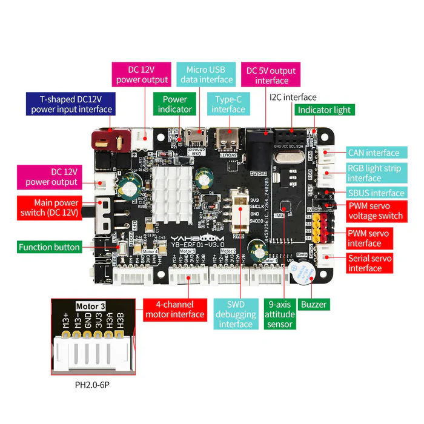
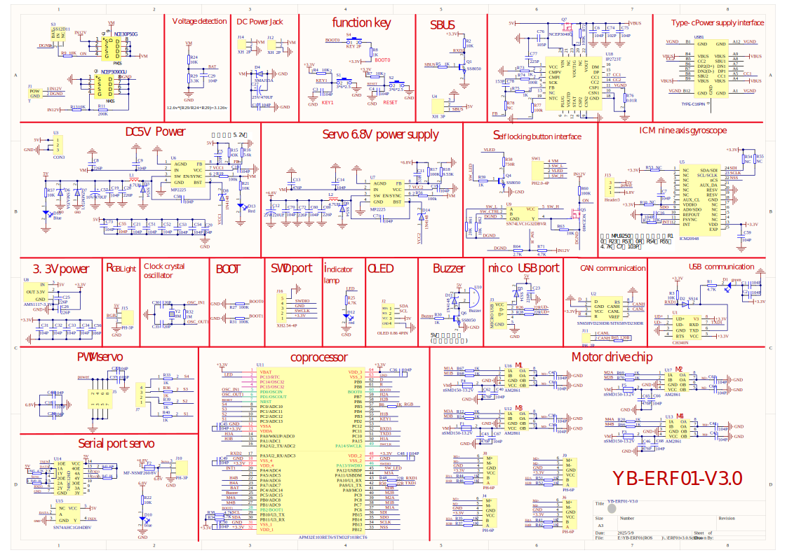

# Product

* Product page : https://category.yahboom.net/products/ros-driver-board

* wiki page : https://www.yahboom.net/study/ROS-Driver-Board

# Schematics

## Components

* AM2857 One Channel H-Bridhe Power Driver 4.0 A Continuous / 6.5 A Peak

* MP2225 5 A continuous. High-frequency, synchronous, rectified, step-down, switch-mode converter with built-in power MOSFETs.

