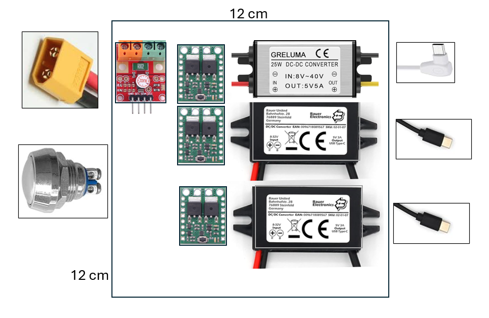
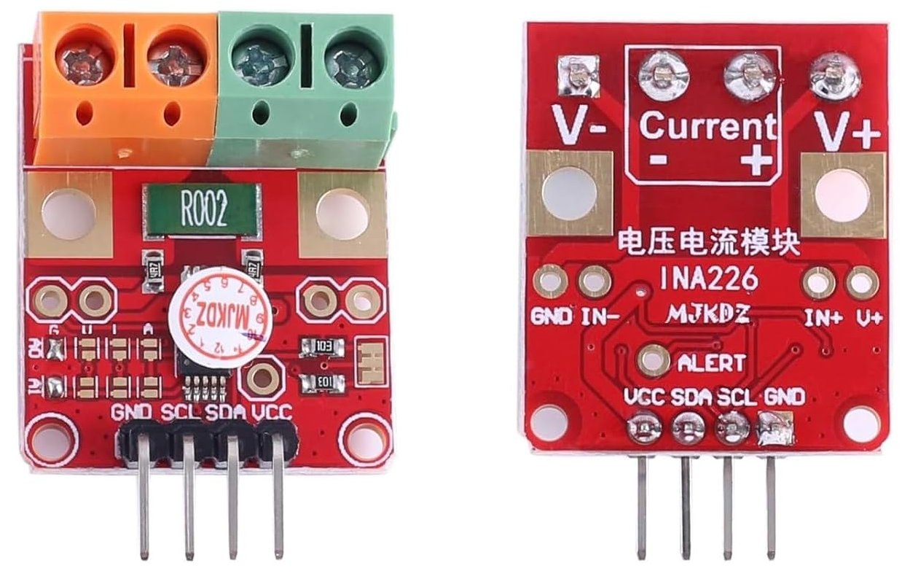

# Overview

# Components

## Power monitor
* INA226 I2C output current/voltage/power monitor.
* R 2 mOhm for 20 A

## Push button

* Big Pushbutton HP : continuous 16 A https://www.pololu.com/product/2813

* Big Pushbutton MP : continuous 8 A https://www.pololu.com/product/2812

## DC-DC Voltage Converters

* 5V USB-C 3A. Input 8-32 V

DC-DC 8V-32V to 5V Voltage Converter USB-C 3A 15W USB Socket 12-V 5V Power Adapter USB Power Supply 24V USB Voltage Converter Buck Converter Step-Down Charger Volt Charging Regulator

* 5V 5A. Input 8-40V

Greluma 1 x DC 12 V 24 V to 5 V Step-Down Converter Regulator 5 A 25 W Power Supply Reducer for Car Electronics Truck Vehicle Boat Solar System (DC 8-40 V Inputs)

