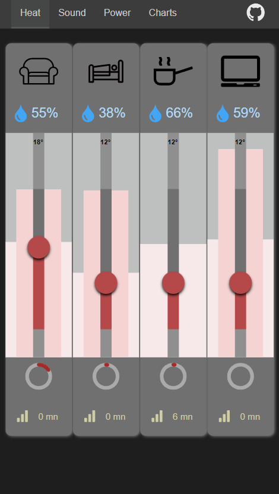

# Astro Home Control

* Home Automation MQTT Client running on Astro as SSR
* Client page update with Server Sent Events
* Custom switches with feedback and custom sliders with animated SVG

:button[]{label="Github repo" link="https://github.com/MicroWebStacks/astro-home-control" icon="github"}

